# Image Minimizer Webpack Plugin - Learning Project

Ein Lernprojekt zum Vergleich zweier verschiedener Bildoptimierungs-Ansätze mit dem **Image Minimizer Webpack Plugin**. Das Projekt demonstriert, wie dieselbe Aufgabe (Bildoptimierung während des Webpack-Builds) mit zwei unterschiedlichen Bibliotheken gelöst werden kann.

## 📁 Projektstruktur

```
image-minimazer-webpack-plugin/
├── imagemin/              # Konfiguration mit klassischen Imagemin-Plugins
│   ├── src/
│   ├── dist/
│   ├── webpack.config.js
│   └── package.json
├── sharp/                 # Konfiguration mit Sharp + SVGO
│   ├── src/
│   ├── dist/
│   ├── webpack.config.js
│   └── package.json
└── examples/              # Vergleichs-Screenshots der Ergebnisse
    ├── Imagemin/
    └── Sharp/
```

## 🔧 Ansatz 1: Imagemin

### Beschreibung

Die **Imagemin**-Konfiguration verwendet bewährte, spezialisierte Plugins für jedes Bildformat. Dies ist der klassische und weit verbreitete Ansatz zur Bildoptimierung im Web-Development.

### Verwendete Plugins

- **gifsicle** - GIF-Optimierung
- **mozjpeg** - JPEG/JPG-Optimierung (von Mozilla)
- **pngquant** - PNG-Optimierung mit verlustbehafteter Kompression
- **svgo** - SVG-Optimierung

### Webpack-Konfiguration

```javascript
optimization: {
    minimizer: [
        "...",
        new ImageMinimizerPlugin({
            minimizer: {
                implementation: ImageMinimizerPlugin.imageminMinify,
                options: {
                    plugins: [
                        ["gifsicle", { interlaced: true, colors: 64, optimizationLevel: 9 }],
                        ["mozjpeg", { quality: 75 }],
                        ["pngquant", { quality: [0.6, 0.8] }],
                        ["svgo", { plugins: [{ name: "preset-default" }] }]
                    ],
                },
            }
        })
    ],
}
```

### Dependencies

```json
{
  "imagemin": "^9.0.1",
  "imagemin-gifsicle": "^7.0.0",
  "imagemin-mozjpeg": "^10.0.0",
  "imagemin-pngquant": "^10.0.0",
  "imagemin-svgo": "^12.0.0"
}
```

### Vorteile

✅ Einfache Konfiguration
✅ Etablierte und bewährte Tools
✅ Jedes Plugin ist spezialisiert auf ein Format
✅ Gute Dokumentation und Community-Support

### Nachteile

❌ Mehrere separate Abhängigkeiten
❌ Weniger Konfigurationsmöglichkeiten
❌ Teilweise langsamer bei großen Bildern

---

## 🚀 Ansatz 2: Sharp + SVGO

### Beschreibung

Die **Sharp**-Konfiguration nutzt die moderne und performante Sharp-Bibliothek für Raster-Bilder (JPEG, PNG, GIF, WebP) in Kombination mit SVGO für SVG-Dateien. Sharp ist bekannt für seine hohe Performance und detaillierten Konfigurationsmöglichkeiten.

### Verwendete Libraries

- **Sharp** - Universelle Bildverarbeitung für Raster-Formate
- **SVGO** - SVG-Optimierung

### Webpack-Konfiguration (Auszug)

```javascript
optimization: {
    minimizer: [
        new ImageMinimizerPlugin({
            minimizer: [
                {
                    implementation: ImageMinimizerPlugin.sharpMinify,
                    options: {
                        encodeOptions: {
                            jpeg: {
                                quality: 70,
                                progressive: true,
                                mozjpeg: true,
                                optimiseCoding: true,
                                trellisQuantisation: true,
                                // ... viele weitere Optionen
                            },
                            png: {
                                compressionLevel: 6,
                                adaptiveFiltering: true,
                                palette: true,
                                quality: 70,
                                effort: 7,
                                // ... viele weitere Optionen
                            },
                            gif: {
                                effort: 7,
                                colours: 256,
                                dither: 1.0,
                                // ... viele weitere Optionen
                            }
                        },
                    },
                },
                {
                    implementation: ImageMinimizerPlugin.svgoMinify,
                    options: {
                        encodeOptions: {
                            multipass: true,
                            plugins: ["preset-default"],
                        },
                    }
                }
            ]
        }),
    ],
}
```

### Dependencies

```json
{
  "sharp": "^0.34.5",
  "svgo": "^4.0.1"
}
```

### Vorteile

✅ Sehr hohe Performance (bis zu 4-5x schneller als Imagemin)
✅ Nur zwei Dependencies statt fünf
✅ Hochgradig konfigurierbar mit vielen Fine-Tuning-Optionen
✅ Modernes, aktiv gewartetes Projekt
✅ Unterstützt auch WebP-Format nativ
✅ Detaillierte Kontrolle über jeden Aspekt der Kompression

### Nachteile

❌ Komplexere Konfiguration
❌ Mehr Lernaufwand für alle Optionen
❌ Native Dependencies (C++ Bindings) können Build-Probleme verursachen

---

## 📊 Vergleich der beiden Ansätze

| Kriterium | Imagemin | Sharp + SVGO |
|-----------|----------|--------------|
| **Performance** | Gut | Exzellent (4-5x schneller) |
| **Konfiguration** | Einfach | Komplex, aber sehr detailliert |
| **Dependencies** | 5 separate Pakete | 2 Pakete |
| **Lernkurve** | Flach | Steiler |
| **Format-Support** | JPEG, PNG, GIF, SVG | JPEG, PNG, GIF, SVG, WebP |
| **Wartung** | Verschiedene Maintainer | Einheitlich (Sharp) |
| **Build-Probleme** | Selten | Möglich (native deps) |

---

## 🖼️ Visuelle Beispiele & Ergebnisse

### JPEG-Optimierung

#### Imagemin (mozjpeg)
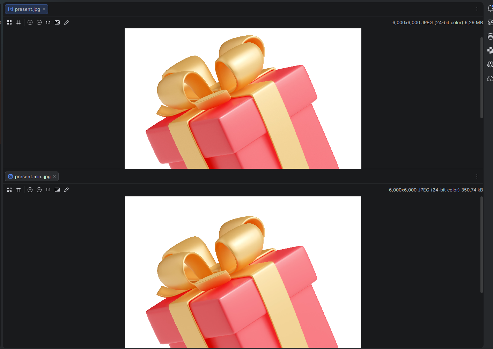
*Zoom-Vergleich:*
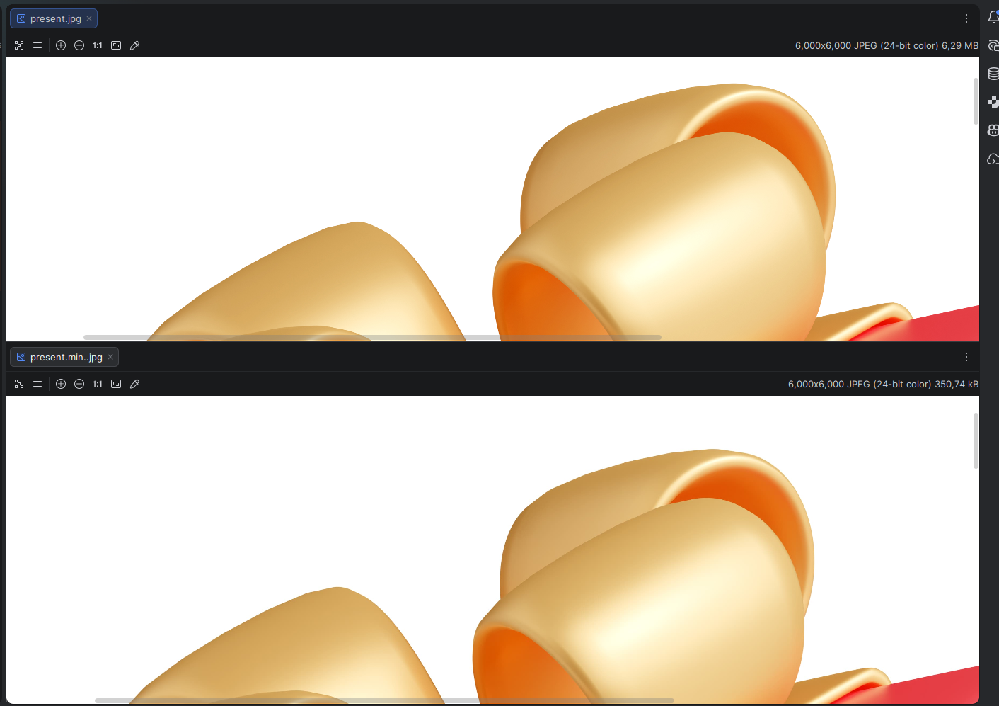

#### Sharp (mozjpeg mode)
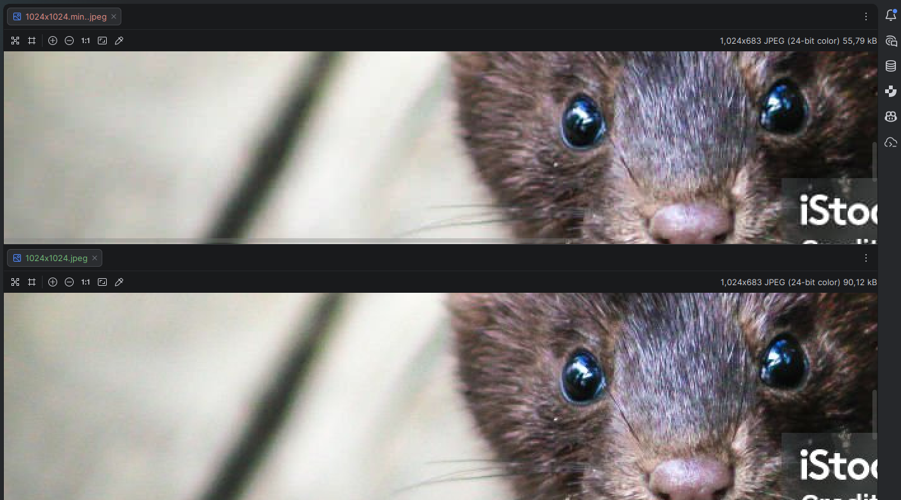
*Zoom-Vergleich:*
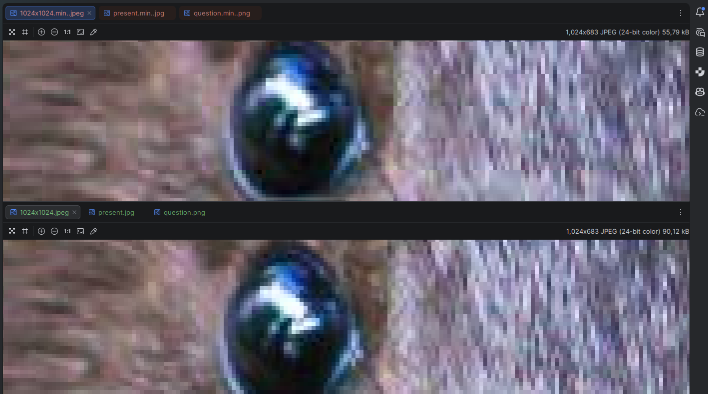

---

### PNG-Optimierung

#### Imagemin (pngquant)
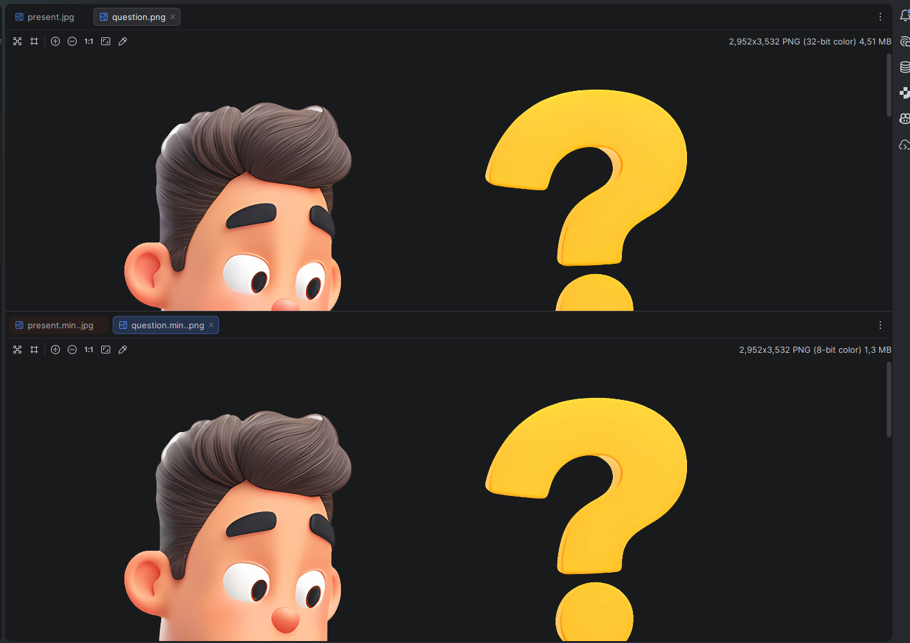
*Zoom-Vergleich:*
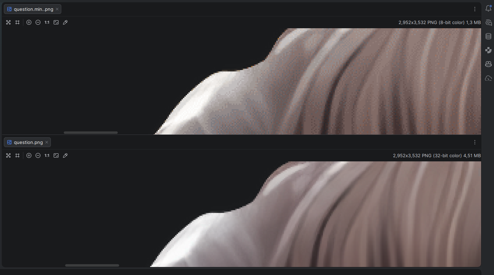

#### Sharp (palette mode)
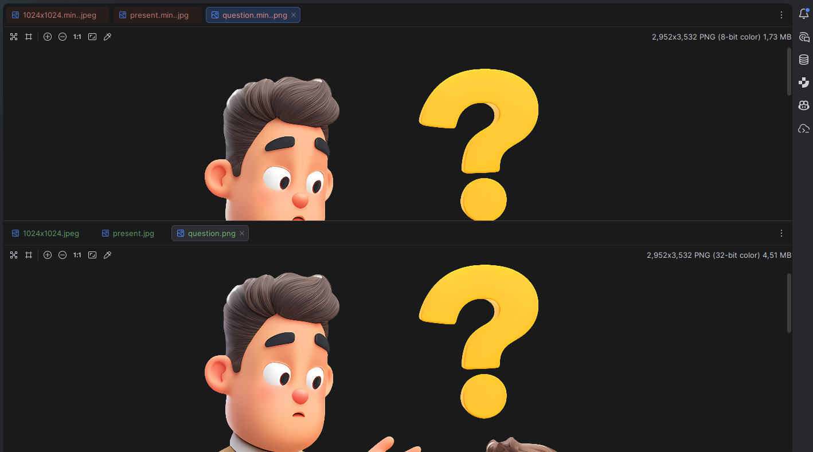
*Zoom-Vergleich:*
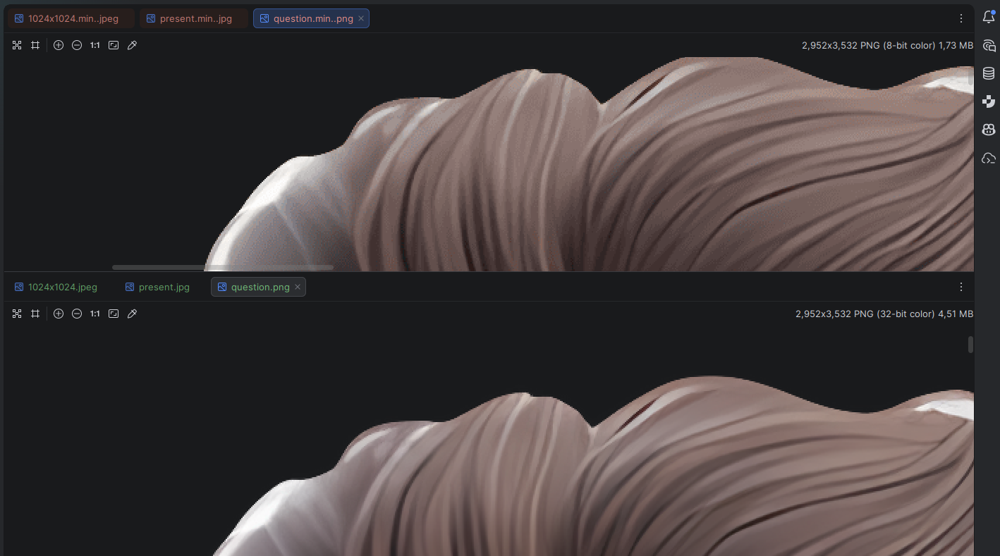

---

### GIF-Optimierung

#### Imagemin (gifsicle)
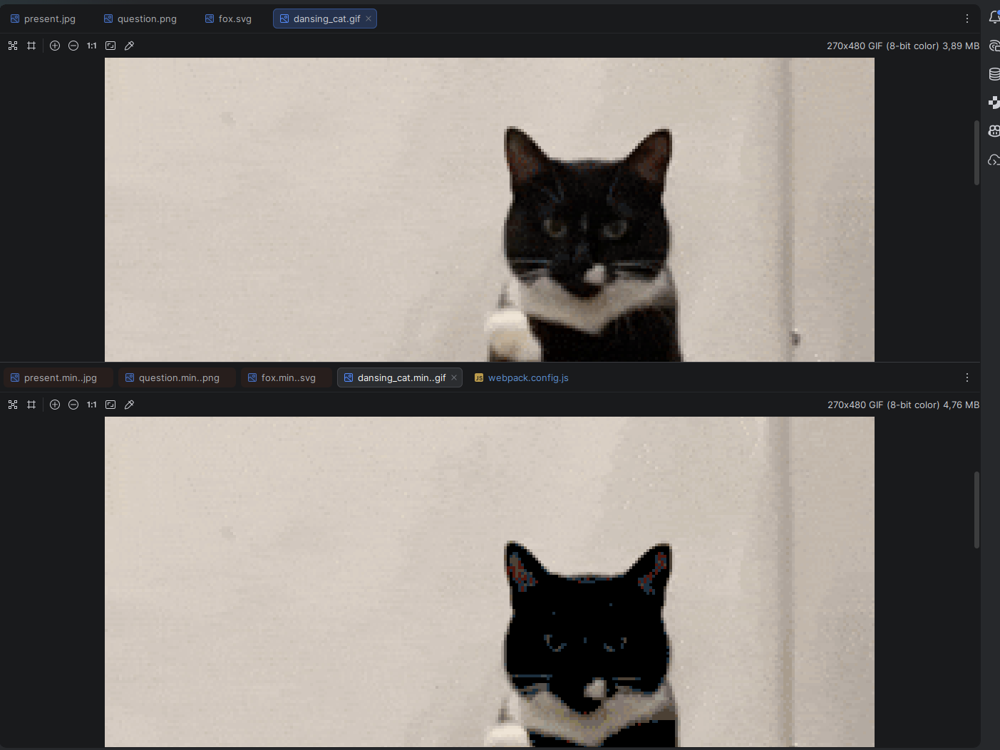

#### Sharp (gif mode)
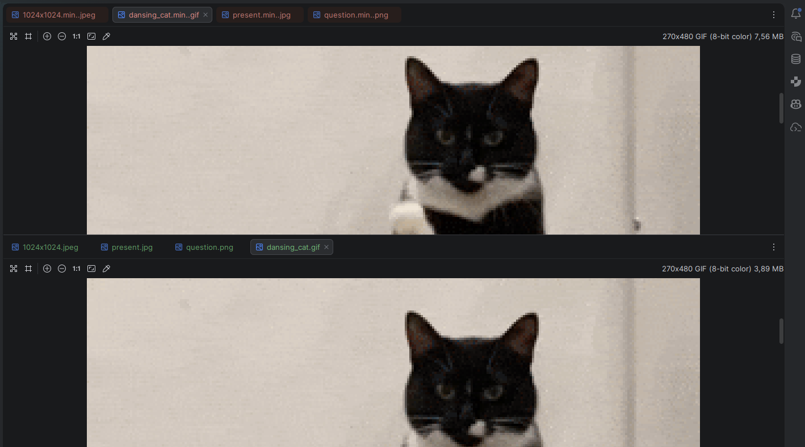
*Zoom-Vergleich:*
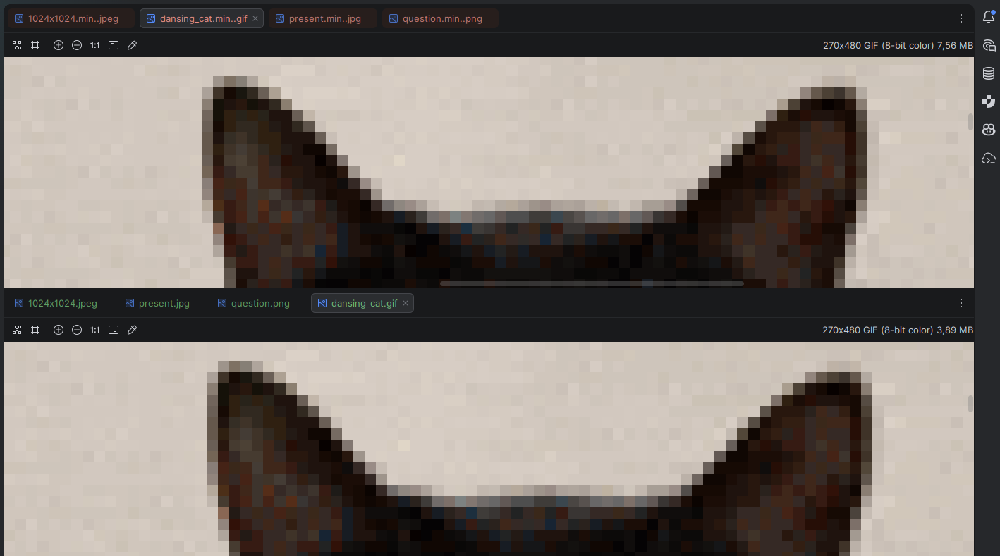

---

### SVG-Optimierung

#### Imagemin (svgo)
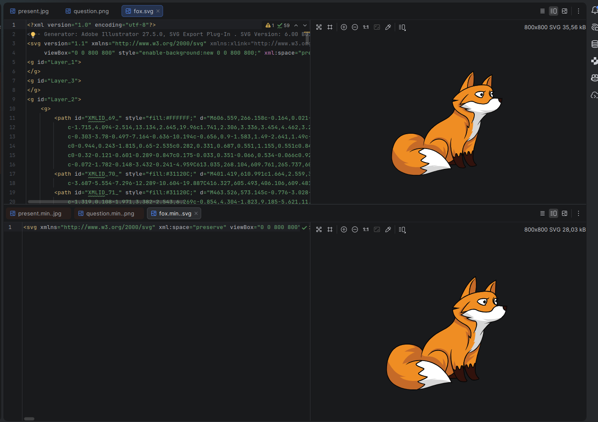
*Zoom-Vergleich:*
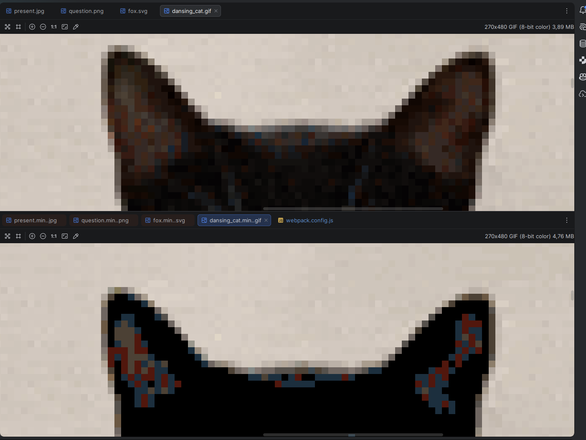

#### Sharp + SVGO (svgoMinify)
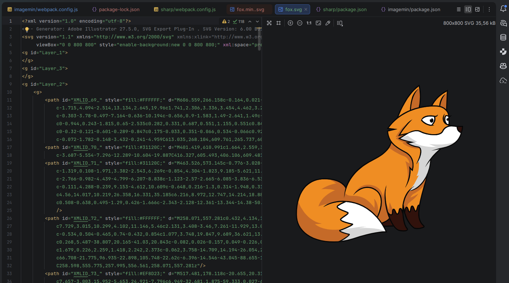
*Minimierte Version:*
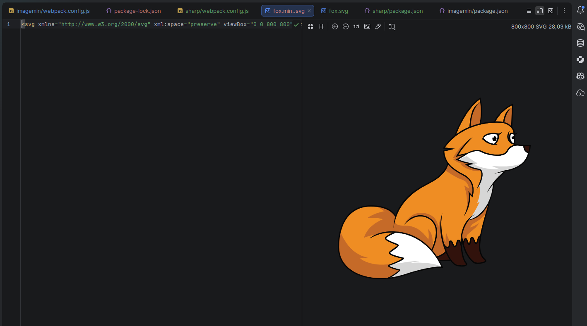

---

## 🚀 Installation & Usage

### Imagemin-Version

```bash
cd imagemin
npm install
```

**Development Server:**
```bash
npm start
```

**Production Build:**
```bash
npm run build
```

### Sharp-Version

```bash
cd sharp
npm install
```

**Development Server:**
```bash
npm start
```

**Production Build:**
```bash
npm run build
```

---

## 💡 Wichtige Erkenntnisse

### Wann Imagemin verwenden?

- **Einfache Projekte** mit Standard-Bildoptimierung
- **Legacy-Projekte** die bereits Imagemin nutzen
- **Schneller Setup** ohne viel Konfiguration
- **Kein WebP-Support** benötigt

### Wann Sharp verwenden?

- **Performance-kritische** Projekte mit vielen/großen Bildern
- **Moderne Projekte** mit WebP-Unterstützung
- **Fine-Tuning** der Kompression ist wichtig
- **Weniger Dependencies** bevorzugt
- **Bereit für Lernaufwand** bei der Konfiguration

---

## 📝 Fazit

Beide Ansätze lösen die gleiche Aufgabe - **Bildoptimierung während des Webpack-Builds** - auf unterschiedliche Weise:

- **Imagemin** ist der **bewährte Standard** mit einfacher Konfiguration
- **Sharp** ist die **moderne Alternative** mit besserer Performance und mehr Kontrolle

Die Wahl hängt von den Projektanforderungen, Performance-Bedarf und der Bereitschaft für eine komplexere Konfiguration ab.

---

## 📚 Weiterführende Links

- [Image Minimizer Webpack Plugin](https://github.com/webpack-contrib/image-minimizer-webpack-plugin)
- [Sharp Documentation](https://sharp.pixelplumbing.com/)
- [Imagemin](https://github.com/imagemin/imagemin)
- [SVGO](https://github.com/svg/svgo)
- [mozjpeg](https://github.com/mozilla/mozjpeg)
- [pngquant](https://pngquant.org/)

---

**Autor:** Aleks
**Lizenz:** ISC
**Projekt-Typ:** Learning Project
